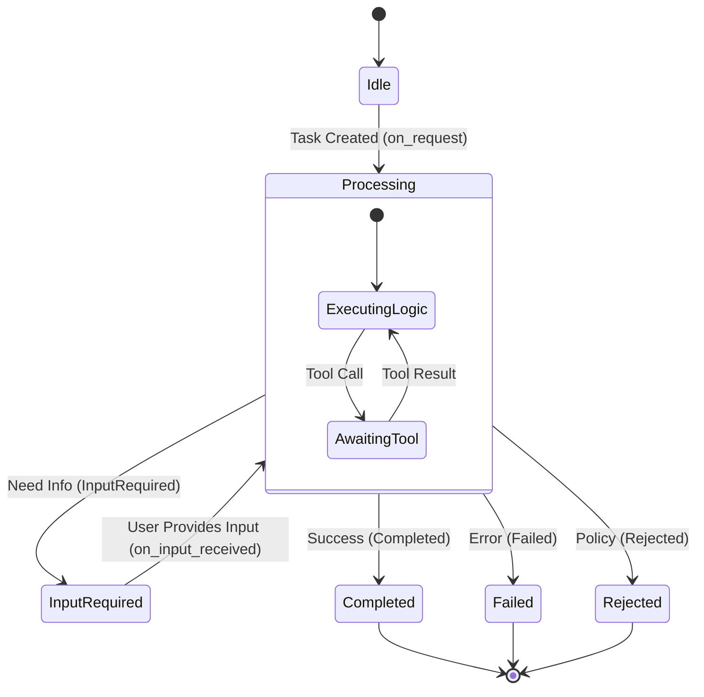

# radkit Architecture & A2A Protocol Guide

## Overview
radkit is not just an LLM wrapper; it is an implementation of the **Agent-to-Agent (A2A) Protocol**. This protocol defines how agents communicate, maintain state, and handle long-running tasks.

## The Two Modes of Operation

### 1. Core (Stateless)
Used for building tools, scripts, or embedding LLM logic into existing apps.
- **`LlmFunction`**: Single-turn, structured output. Think "smart function call".
- **`LlmWorker`**: Multi-turn loop with tool execution. Think "chat loop".
- **State:** Managed entirely by the caller.

### 2. Runtime (Stateful / A2A)
Used for building standalone Agents that act as servers.
- **`Agent`**: The definition of identity (Name, Description, Instructions).
- **`SkillHandler`**: The implementation of capability (Logic).
- **`Runtime`**: The host environment (HTTP server, Memory, Auth).
- **State:** Managed by the Runtime (Task Store, Event Bus).

## The A2A State Machine
When running in `Runtime` mode, every task follows a strict lifecycle.

### Lifecycle Hooks
1. **`on_request`**: The entry point.
   - Transitions from `Idle` to `Processing`.
   - You must return an `OnRequestResult` to decide the next state.

2. **`on_input_received`**: The resumption point.
   - Transitions from `InputRequired` back to `Processing`.
   - Only called if the task was previously in `InputRequired`.

## SkillHandler Implementation Strategy

### The "Slot" Pattern for Multi-turn Conversation
When an agent needs to ask the user a question, it cannot "block" execution. Instead, it must:
1. Save any intermediate calculation to `state.task()`.
2. Return `OnRequestResult::InputRequired` with a `SkillSlot`.
3. The `SkillSlot` acts as a "bookmark" indicating *what* we are waiting for.

**Example Flow:**
1. **User:** "Book a flight."
2. **Agent (`on_request`):** See "Book flight". Need destination.
   - Return `InputRequired { message: "Where to?", slot: Slot::Destination }`
3. **User:** "Paris."
4. **Agent (`on_input_received`):**
   - Check `slot` is `Destination`.
   - Read "Paris".
   - Return `Completed { message: "Booked to Paris!" }`

## Data Model

### `Thread` Immutability
The `Thread` type is the backbone of conversation history.
**Crucial Rule:** `Thread` is an **immutable builder**.
- `thread.add_event(e)` does NOT change `thread`.
- It returns a **new** `thread` with the event added.

### `Artifacts`
Agents produce `Artifacts` (files, reports, data) rather than just text.
- Use `Artifact::from_json` for structured data.
- Use `Artifact::from_file` for images/binary.
- Artifacts are only finalized when the task transitions to `Completed`.
